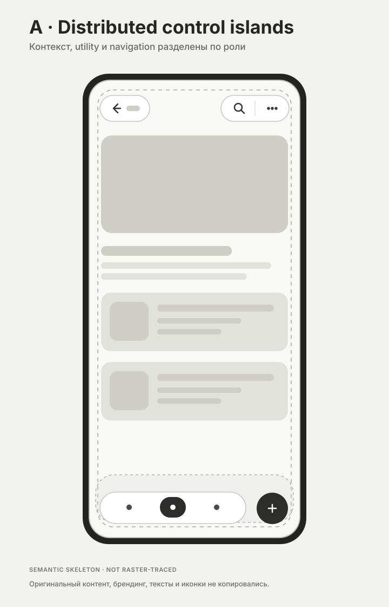
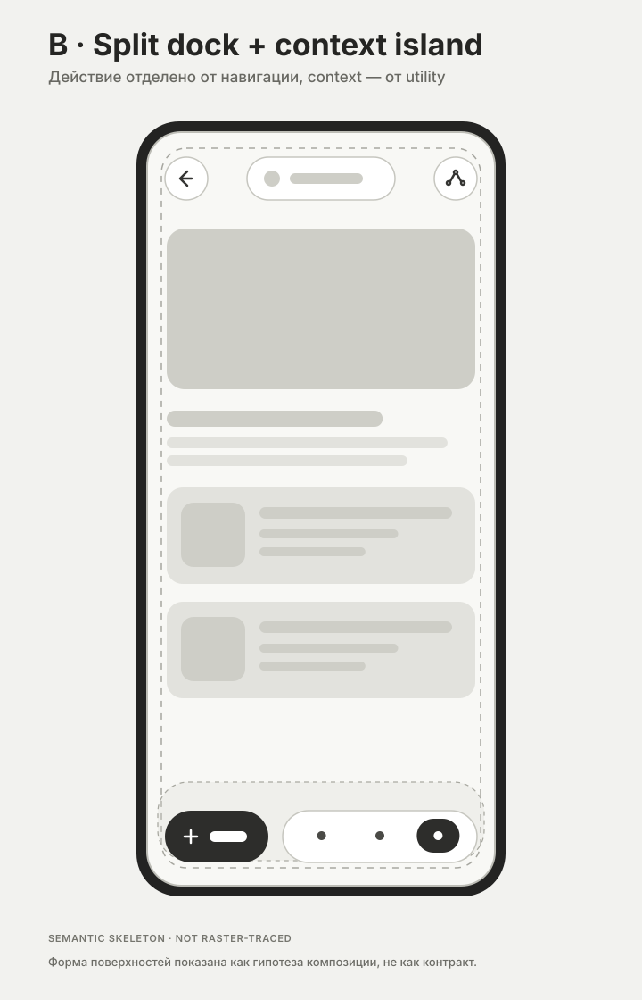

# Floating control islands / detached chrome

> **Статус:** exploration input. Это не accepted component family, не component contract, не токены и не решение о замене текущей шапки или bottom navigation.

Обезличенный семантический референс служебного UI, где application chrome не образует две монолитные полосы по краям viewport, а распределён между несколькими компактными плавающими поверхностями.

## Что удалось получить из источника

| Поле | Результат |
|---|---|
| Источник | Telegram: `https://t.me/c/4337049383/1162` |
| Чат | `KenigEvents · UI review` |
| Сообщение | найдено и прочитано через eventsBot MCP |
| Вложения | альбом из 2 media items |
| Исходные пиксели | **не получены**: `social_asset_preview` отклоняет materialization media refs даже для контрольной доступной story |
| Fidelity этого набора | **semantic skeleton, not raster-traced** |
| Исходный контент в Git | отсутствует: не копировались тексты, логотипы, фотографии, брендинг или оригинальные иконки |

Следствие: этот набор фиксирует **структурную гипотезу из наблюдения владельца** — переход от монолитной верхней/нижней полосы к отделённым capsule-shaped control surfaces. Он не фиксирует точные размеры, цвета, material, blur, elevation, иконки, количество элементов или scroll behavior исходных экранов.

## Как это называть

Рекомендуемая рабочая терминология:

- **detached chrome / floating chrome** — общий подход: служебный UI отделён от края viewport и визуально плавает над content canvas;
- **floating control islands** — композиционный принцип: chrome разбит на небольшое число поверхностей по семантическим ролям;
- **floating toolbar / utility island** — капсула с группой родственных служебных действий;
- **floating navigation dock / floating tab bar** — отделённая от края группа destination navigation;
- **pill button / action pill** — одиночное действие в capsule geometry.

`Chip` здесь неточен. Chip — прежде всего компактный input/filter/select/suggestion control. Capsule — форма, а control island — контейнер или композиция.

## Извлечённая структурная гипотеза

1. **Content-first canvas.** Контент остаётся непрерывной основной плоскостью; chrome накладывается поверх неё, а не отрезает две постоянные полосы.
2. **Semantic islands.** Context, utility, destination navigation и primary/contextual action могут иметь разных владельцев и поэтому не обязаны жить в одном монолитном контейнере.
3. **Navigation stays grouped.** Элементы одной navigation model следует держать в одном dock; дробление каждого destination в отдельную капсулу создаёт визуальный шум и ухудшает считывание группы.
4. **Detached action only by role.** Отдельный action island оправдан другой семантикой или приоритетом, а не одной лишь декоративной асимметрией.
5. **Edge detachment is layout behavior.** Safe-area anchoring, viewport inset, keyboard avoidance, scroll compaction и occlusion принадлежат layout/runtime contract, а не внутреннему API icon button.
6. **Arbitrary-underlay contrast.** Floating surface должна сохранять читаемость над изображением, карточкой и пустым canvas; material/blur/elevation нельзя принимать без реальных underlay fixtures.

## Визуальные skeletons

### A · Distributed control islands

Контекст слева, utility-группа справа, navigation dock снизу и отдельное primary/contextual action. Это не рекомендация всегда использовать четыре острова; это тестовая anatomy-композиция.

### B · Split dock + context island

Контекстная capsule в верхней зоне, отдельное utility action и split bottom composition. Вариант нужен для проверки семантической группировки, а не для выбора winner.

### Anatomy

## Слоты для проверки в LoveKGD

| Semantic slot | Роль | Disposition в этом артефакте |
|---|---|---|
| `top-leading-context` | back / close / scope | `unresolved` |
| `top-context-summary` | краткая page/context identity | `unresolved` |
| `top-trailing-utility` | search / share / overflow и родственные actions | `unresolved` |
| `bottom-destination-navigation` | переход между основными destinations | `unresolved` |
| `bottom-contextual-action` | действие текущего surface | `unresolved` |
| `control-surface-material` | background, border, elevation, blur, contrast | `unresolved` |
| `floating-chrome-anchor` | safe area, viewport inset, keyboard/scroll behavior | `runtime_only` candidate; контракт не принят |
| `content-occlusion-compensation` | last-item inset и достижимость контента | `runtime_only` candidate; контракт не принят |

Ни один слот не объявлен `reuse_existing` или `new_component`: сначала требуется сопоставление с актуальным production registry и archetype contracts. Визуальное сходство не является основанием для merge или нового component identity.

## Вопросы следующей проверки

- Какие из двух исходных экранов используют destination navigation, а какие — contextual actions?
- Сохраняются ли острова при scroll или меняют размер/состав?
- Что происходит с keyboard, modal sheets, landscape и узкими viewport?
- Есть ли blur/translucency или это opaque surfaces?
- Как обеспечен contrast над фотографиями и насыщенными poster backgrounds?
- Является ли top context интерактивным или только informational?
- Какие current Astro controls уже покрывают внутренние action slots без создания нового компонента?

## Adoption gate

До получения исходных пикселей и проверки production output запрещено:

- считать геометрию skeleton эталонной;
- переносить указанные размеры или spacing в tokens;
- заменять существующие header/bottom-navigation artifacts;
- принимать `FloatingControlSurface`, `FloatingToolbar` или `FloatingNavDock` как component families;
- делать speculative merge существующих controls по capsule geometry;
- материализовать это как canonical Penpot component.

Допустимое использование сейчас: reference board для owner discussion, archetype exploration и подготовки fixture matrix.
