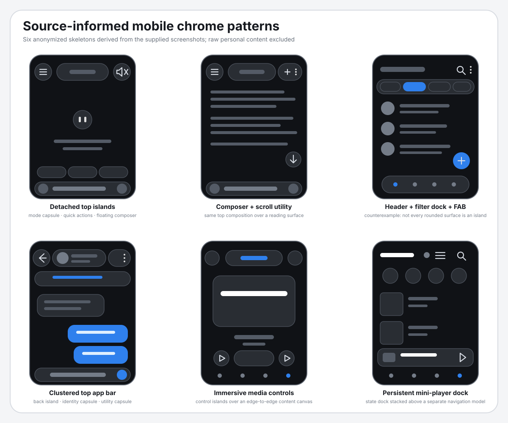
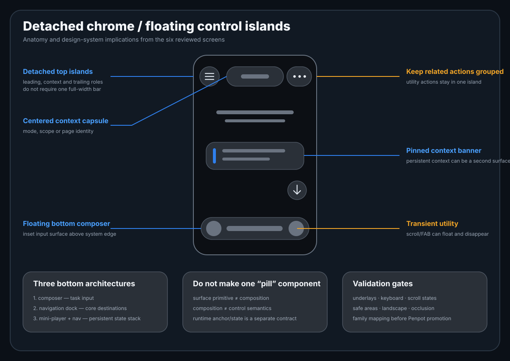

# Floating control islands / detached chrome

> **Статус:** exploration input. Материал фиксирует визуально подтверждённые паттерны из шести приложенных экранов, но не принимает component family, tokens, Penpot components и не разрешает замену текущей шапки или bottom navigation.

Обезличенный набор референсов для служебного UI, где application chrome частично отделяется от краёв viewport и раскладывается по компактным role-owned surfaces: icon islands, context capsules, utility clusters, composers, navigation docks и persistent media docks.

## Источник и fidelity

| Поле | Результат |
|---|---|
| Первичный указатель | Telegram: `https://t.me/c/4337049383/1162` |
| MCP | сообщение и metadata прочитаны; materialization media bytes не сработала |
| Фактический visual input | 6 скриншотов `921×2048`, приложенных владельцем непосредственно в текущем треде |
| Visual review | выполнен по всем 6 изображениям |
| Fidelity производных изображений | source-informed anonymized skeletons |
| Raw screenshots в Git | **не добавлены**: на них есть имена, сообщения, аватары и сторонний контент |
| Machine-readable разбор | [`screen-observations.json`](screen-observations.json) |

Новые вложения снимают прежнее ограничение «исходные пиксели не получены» для дизайн-разбора. Ошибка MCP остаётся отдельной инфраструктурной проблемой и не должна больше ограничивать fidelity этого reference pack.

## Как называть паттерн

Единого стандартного названия для всей совокупности экранов нет. Рабочая терминология:

- **detached chrome / floating chrome** — общий подход: служебные controls визуально отделены от края viewport и могут лежать над content canvas;
- **floating control islands** — композиционный принцип: chrome разделён на несколько поверхностей по семантическим владельцам;
- **floating top app bar / clustered top app bar** — верхняя композиция из leading, center/context и trailing/utility областей;
- **context capsule / mode capsule** — центральная капсула с режимом, scope или page identity;
- **utility island / utility cluster** — поверхность для родственных служебных действий;
- **floating composer** — inset input surface над системным краем;
- **floating navigation dock** — отделённая от края, но цельная destination navigation;
- **persistent mini-player dock / now-playing dock** — persistent state/action surface над нижней навигацией.

`Pill` или `capsule` описывают форму. `Chip` корректен только для компактного выбора, фильтра, suggestion или input-token; им нельзя называть всю шапку, composer или navigation dock.

## Разбор экранов

| ID | Экран | Основная композиция | Наблюдаемые служебные элементы |
|---|---|---|---|
| A | Kimi · главная | `detached_top_islands` | leading menu island, centered mode capsule, trailing mute island, quick-action chips, floating composer |
| B | Kimi · чтение | `floating_composer_with_scroll_utility` | та же top composition, trailing utility capsule, transient scroll button, floating composer |
| C | Telegram · список | `header_filter_dock_fab_nav` | более монолитный header, segmented filter dock, context banner, FAB, floating navigation dock |
| D | Telegram · диалог | `clustered_top_app_bar` | back island, identity capsule, utility capsule, pinned context banner, bottom composer |
| E | медиаплеер | `immersive_media_control_cluster` | centered title pill, edge actions, playback islands, borderless bottom navigation |
| F | медиатека | `persistent_media_dock_stack` | content header actions, persistent mini-player dock, отдельная bottom navigation model |

Экран C важен как контрпример: современный rounded UI не означает, что все служебные зоны обязаны стать islands. Здесь header остаётся относительно цельным, а filters, FAB и navigation вынесены в отдельные слои.

## Извлечённые паттерны

1. **Role-owned top chrome.** Leading navigation, center context и trailing utilities могут иметь разных владельцев и разные lifecycle/state rules.
2. **Content-first canvas.** Контентная плоскость не обязана начинаться после полной app-bar полосы; chrome может накладываться поверх неё.
3. **Related actions stay grouped.** Call + overflow, playback controls или destination navigation не следует дробить на отдельные pills без семантической причины.
4. **Bottom chrome имеет разные архитектуры.** Composer, navigation dock и mini-player + navigation stack — разные compositions, а не варианты одной универсальной панели.
5. **Transient utilities float independently.** Scroll-to-bottom и FAB могут появляться над контентом и исчезать без изменения основной layout flow.
6. **Persistent state can form a dock.** Now-playing surface сохраняет состояние и действия между экранами, оставаясь отдельной от destination navigation.
7. **Borderless navigation is possible.** Нижние destinations могут быть сгруппированы семантически без общей видимой подложки; отсутствие container не отменяет единую navigation model.

## Что это означает для LoveKGD

| Semantic slot / primitive | Роль | Disposition |
|---|---|---|
| `top-leading-context` | back / menu / close / scope entry | `unresolved` |
| `top-center-context` | mode, page identity, scope summary | `unresolved` |
| `top-trailing-utility` | search, share, call, overflow, mute | `unresolved` |
| `context-banner` | pinned or persistent page context | `unresolved` |
| `quick-action-chip-row` | suggestions / shortcuts | `unresolved` |
| `floating-composer` | task input and attachments/voice | `unresolved` |
| `floating-scroll-utility` | transient recovery/navigation action | `unresolved` |
| `bottom-destination-navigation` | core destinations | `unresolved` |
| `persistent-state-dock` | mini-player or other cross-screen state | `unresolved` |
| `control-surface-material` | background, border, elevation, blur, contrast | `unresolved` |
| `floating-chrome-anchor` | safe area, viewport inset, keyboard and scroll behavior | `runtime_only` candidate; contract not accepted |
| `content-occlusion-compensation` | last-item inset and reachability | `runtime_only` candidate; contract not accepted |

Ни один элемент пока не помечен `reuse_existing` или `new_component`. Сначала требуется mapping к актуальному production registry и archetype contracts.

## Не делать один универсальный «pill component»

Визуально похожая capsule geometry не доказывает общую component identity. Безопаснее разделять четыре уровня:

1. **Surface primitive:** material, radius, border, elevation, contrast.
2. **Composition:** top app bar, composer, navigation dock, mini-player dock.
3. **Control semantics:** icon button, segmented control, chip, text input, destination item.
4. **Runtime behavior:** safe area, keyboard avoidance, scroll compaction, occlusion, show/hide.

Shared primitive допустим только там, где совпадают state model, accessibility и underlay requirements. Композиции нельзя сливать только по округлой форме.

## Обязательная fixture/state matrix перед применением

- plain, photo, poster и saturated underlays;
- expanded / compact / scrolled top state;
- keyboard open / closed;
- modal or sheet open;
- long title, badge, notification and overflow states;
- narrow viewport and landscape;
- one-handed reach and system navigation insets;
- last-item reachability under floating bottom chrome;
- reduced motion and high-contrast modes.

## Adoption gate

До family mapping и runtime validation запрещено:

- считать геометрию skeleton эталонной;
- переносить размеры, blur, elevation или spacing в tokens;
- заменять существующие header/bottom-navigation artifacts;
- принимать `FloatingControlSurface`, `FloatingTopAppBar`, `FloatingComposer` или `FloatingNavDock` как component families;
- делать speculative merge по capsule geometry;
- материализовать этот набор как canonical Penpot components.

Допустимое использование сейчас: owner review, archetype exploration, comparison with current Astro output и подготовка fixture matrix.

## Дополнительные exploratory варианты

Ранние абстрактные варианты сохранены как вспомогательные, но не являются source-faithful трассировкой:

- [Distributed control islands](assets/variant-a-distributed.svg)
- [Split dock + context island](assets/variant-b-split-dock.svg)
