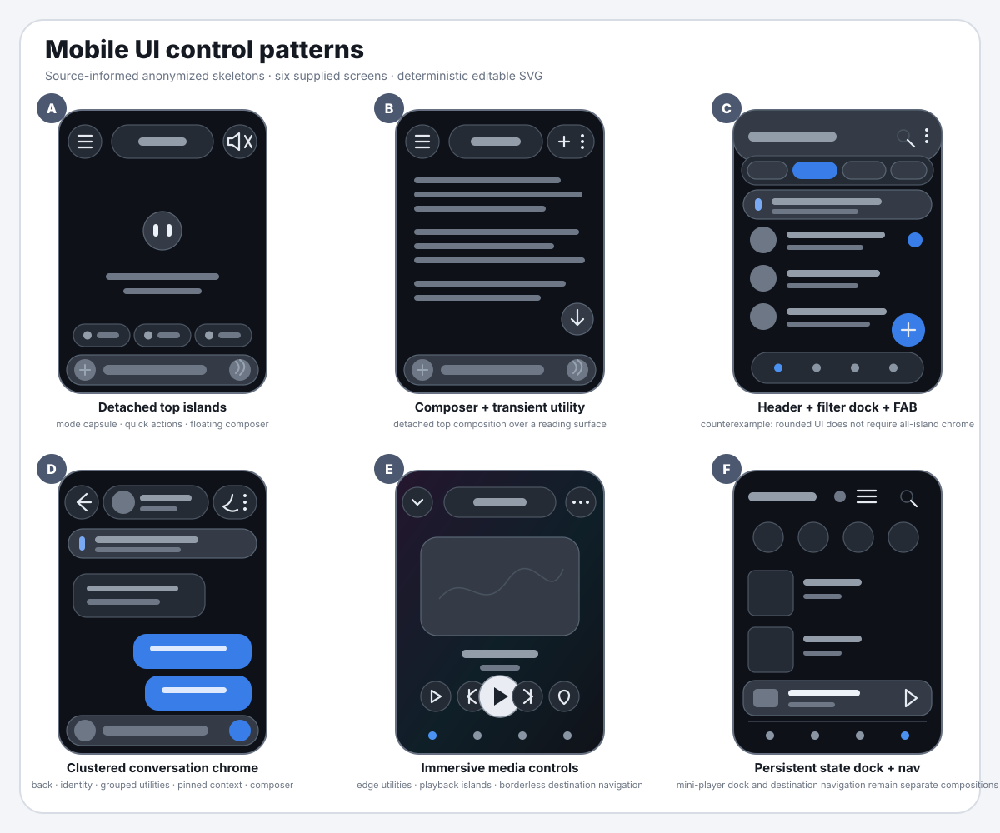
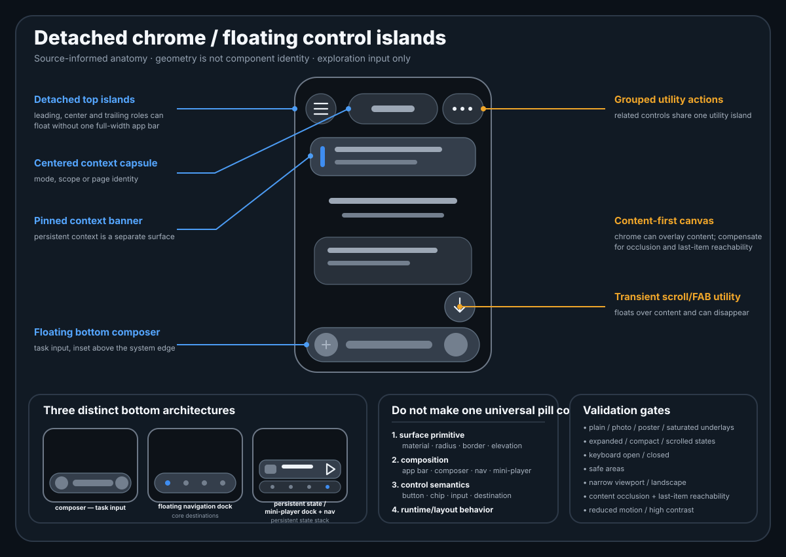

# Floating Islands / detached chrome — KenigEvents

Pattern ID: **`pattern.detached-chrome-control-islands`**. Продолжение существующего [PR #47](https://github.com/onedayonemasterpiece/lovekgd-design-system/pull/47).

**2026-09-05: сквозная система документально спроектирована. Новая система ещё не внедрена, новый visual skin не принят; A=S=P и нормализация сайта не объявляются пройденными.** Исследовательские skeletons остаются `exploration_input`, не native components и не источник новых foundation tokens.

## Текущая спецификация — одна точка входа

Правила системы состоят из **FI-01–FI-20** (composition/layout/interaction) и обязательных **RB-01–RB-03** (стыки с текущими delivery/analytics/personalization owners). Эти части не дублируют друг друга; обе принадлежат тому же pattern. При реализации читать обе, а не только историческую редакцию voice или список CSS-правил.

| Документ | За чем идти |
|---|---|
| [Системная спецификация v1](system-design-v1.md) | FI-01–FI-20: роли, композиции, состояния, геометрия, scroll/keyboard, layers, accessibility, Search adapter и A=S=P. |
| [Обязательные release bindings v1](release-bindings-v1.md) | RB-01–RB-03: честные receipt states, occupied-space→exposure/served-list bridge, profile freeze/global hides/undo, три MeasurementQuestions и пять дополнительных acceptance cases. Учтено параллельное обновление #587 до `c048ebe…`. |
| [Матрица потребителей и состояний](consumer-matrix-v1.md) | Все 17 archetypes прочитанного реального registry, owners/routes, шесть proposed compositions и state fixtures. Полноту текущего release manifest заново проверяют перед миграцией. |
| [Первый пакет реализации FI-P1](implementation-package-1.md) | Shared geometry + контекст полок «Популярного», совместимость Today/Free/event-detail; 32 основных сценария плюс обязательные пять bindings-cases; критерии поставки. |
| [Источники и решения](sources-and-decisions-v1.md) | Source/public SHA исходного fresh-read, записи владельца, личные browser observations, Penpot safety block и границы доказательств. Поздний parallel-source read отдельно зафиксирован в release-bindings. |
| [Pattern dossier / gate](planned-design-pattern.md) | Направление, этап, адресное before→after уточнение допуска к проектированию. |
| [Planned-pattern JSON](planned-pattern.json) | Lifecycle/proposed variant ссылки; не production manifest или второй контракт геометрии. Обязательные consumer bindings читаются из этого entrypoint. |

**Уточнение допуска:** документальный дизайн/fixtures готовятся сейчас; визуальное изменение требует честного baseline затронутого потребителя. Полный незавершённый AS-IS/P всего сайта не блокирует проектирование. Без реального native P никто не заявляет A=S=P. Production promotion, shared foundations и STATUS остаются под действующими владельцами. Подробный owner amendment — FI-01.

Голосовой Search — один из потребителей; product/API/capture/лимиты принадлежат [events-bot-new#587](https://github.com/onedayonemasterpiece/events-bot-new/pull/587). Интеграция/normalization — [#621](https://github.com/onedayonemasterpiece/events-bot-new/issues/621). Tracker [#39](https://github.com/onedayonemasterpiece/lovekgd-design-system/pull/39) направляет сюда, не создаёт альтернативный system design.

## Сохранённая исследовательская база

Это anonymized source-informed skeletons по шести ранее переданным владельцем mobile screenshots, не готовые экраны KenigEvents. Текст gates на исторической anatomy board читается с текущим FI-01; картинка не переопределяет документ.

| Поле | Исторически зафиксировано |
|---|---|
| Telegram source | `https://t.me/c/4337049383/1162` |
| eventsBot MCP | Metadata прочитаны; materialization исходных media bytes не удалась |
| Прямой визуальный input | Шесть отдельных attachments 921×2048, просмотренных автором исходного исследования |
| Media count в Telegram metadata | Два элемента альбома; это не число шести прямых attachments |
| Raw screenshots в Git | Не сохраняются: private names/messages/avatars и чужие изображения/branding |
| Наблюдения | [screen-observations.json](screen-observations.json) |
| Provenance | [source-manifest.json](source-manifest.json) |
| Полный исходный текст | [README до системного проектирования](https://github.com/onedayonemasterpiece/lovekgd-design-system/blob/774bcf0659915dffa16431847d408b2a6a6f2302/docs/research/floating-control-islands-2026-08/README.md) |

В окне 2026-09-05 перечитаны observations; повторный просмотр исходных шести приватных изображений не заявляется. Новые настоящие KenigEvents browser captures перечислены отдельно в sources.

| Пример | Сохраняемый вывод |
|---|---|
| Kimi home | Leading menu, mode context, audio utility и composer имеют разных owners. |
| Kimi reading | Transient scroll utility не меняет место чтения или identity composer. |
| Telegram chat list | Сравнительно монолитная шапка совместима с отдельными filter/FAB/navigation поверхностями. |
| Telegram conversation | Back, identity, related utilities и pinned context — разные согласованные роли. |
| Media player | Immersive canvas может начинаться сверху; важный контент не разрешается перекрыть автоматически. |
| Media library | Persistent state и destination navigation различны; новый плеер в KenigEvents не поручен. |

## Термины и непрерывность

`Detached chrome` / `floating chrome` описывают отделённую оболочку; `floating control islands` — композицию role-owned поверхностей. `Pill` и `capsule` — геометрия, не component identity. `Chip` — компактный filter/select/suggestion/input control, не название всей шапки, composer или nav.

Четыре слоя: **surface → composition → control semantics → runtime/layout behavior**. Общий radius не является достаточным основанием объединить components. Состав действий определяется реальными consumers; чужие интерфейсы не копируются один в один.

Source-era `unresolved`, `reuse_existing=[]`, `new_component=[]` в observational JSON — исторические dispositions. Current applicability/proposals читаются выше; принятие новых native families/tokens не заявлено.

## Ранние exploratory variants

[Distributed control islands](assets/variant-a-distributed.svg) и [Split dock + context island](assets/variant-b-split-dock.svg) — ранние non-source-faithful варианты, не трассировки шести изображений, не C1–C6 и не A=S=P evidence.

Для visual adoption нужны реальные baseline/candidate с теми же fixtures/assets/states/viewport, component lineage, browser/device evidence и owner review. Нельзя переносить blur/размеры/spacing/elevation skeletons в foundations либо тихо заменять принятый nav. Эти guards не запрещают уже разрешённое документальное проектирование.
